```markdown
# Hệ Thống HTTDTD v3.1 - Sơ Đồ Kiến Trúc (Mermaid)

## 1. Kiến Trúc Tổng Thể Hệ Thống

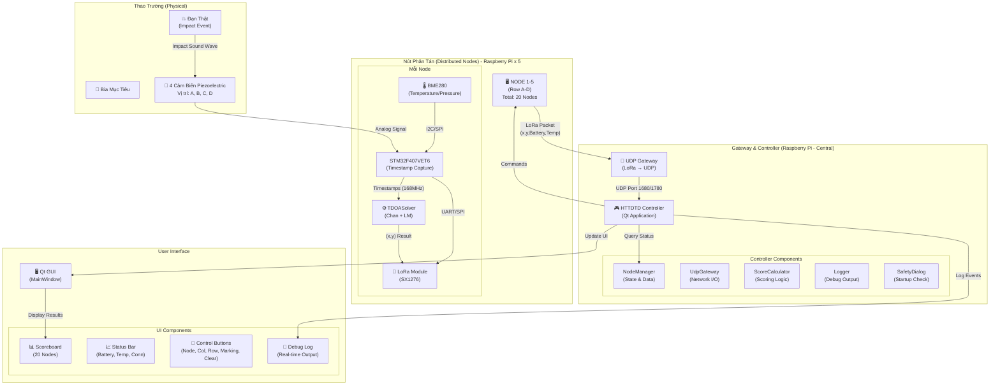

---

## 2. Luồng Dữ Liệu Quá Trình Bắn (Firing Process)

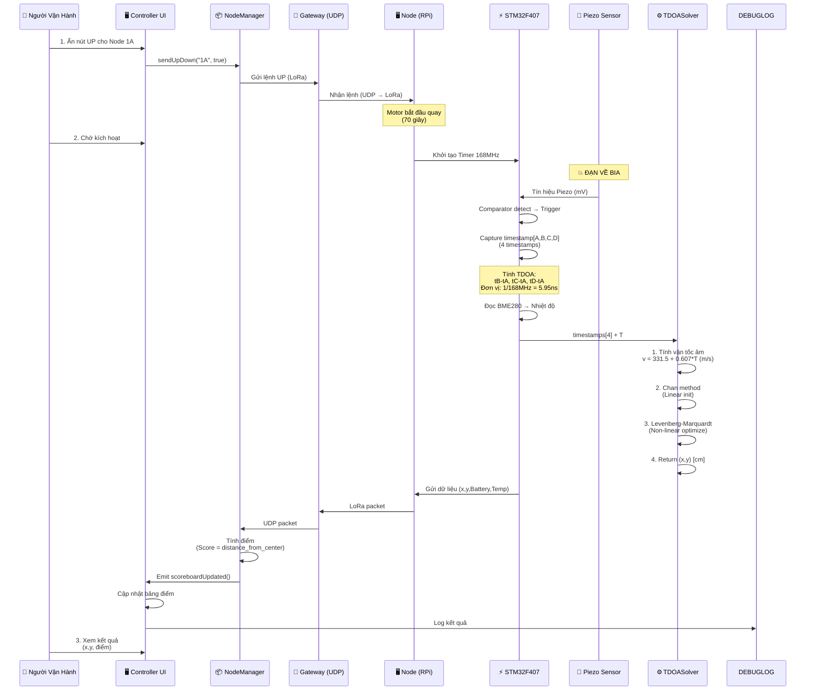

---

## 3. Kiến Trúc Firmware STM32F407

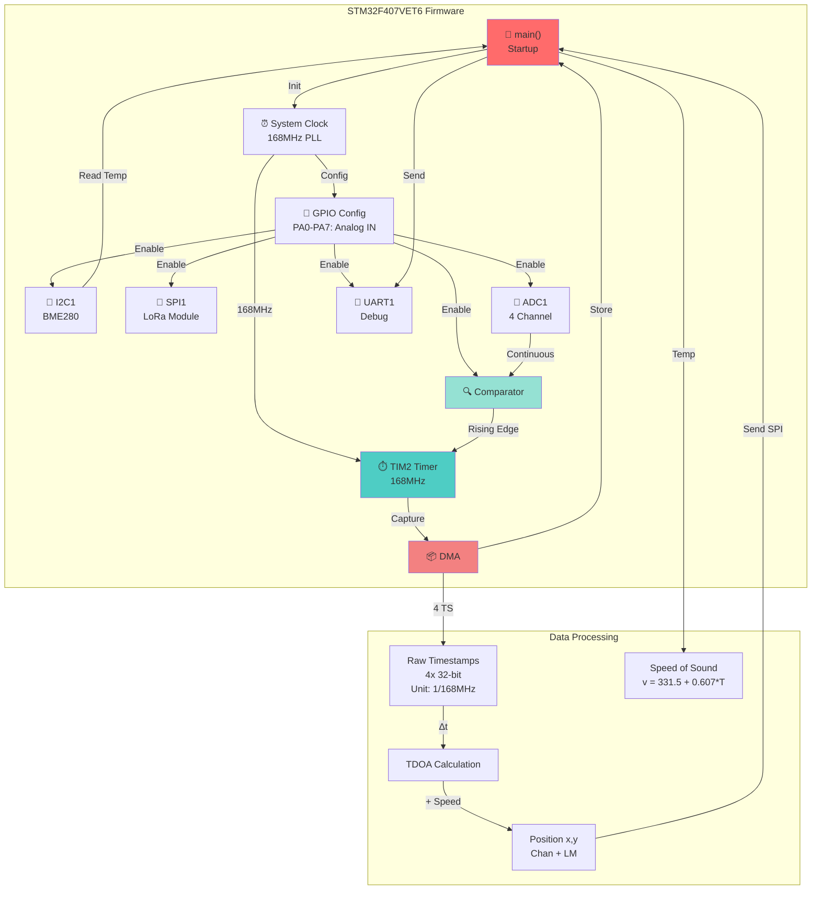

---

## 4. Luồng Chi Tiết TDOASolver

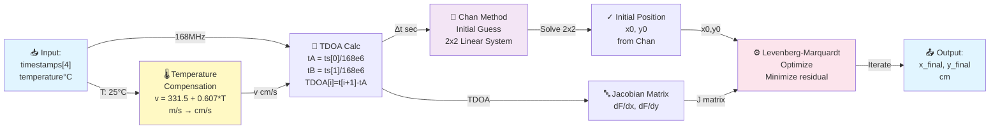

---

## 5. Luồng Khởi Động (Startup Sequence)

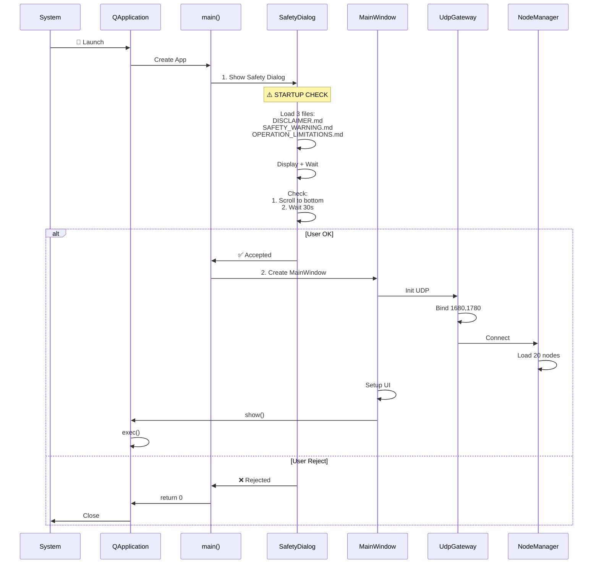

---

## 6. NodeManager - Quản Lý Trạng Thái

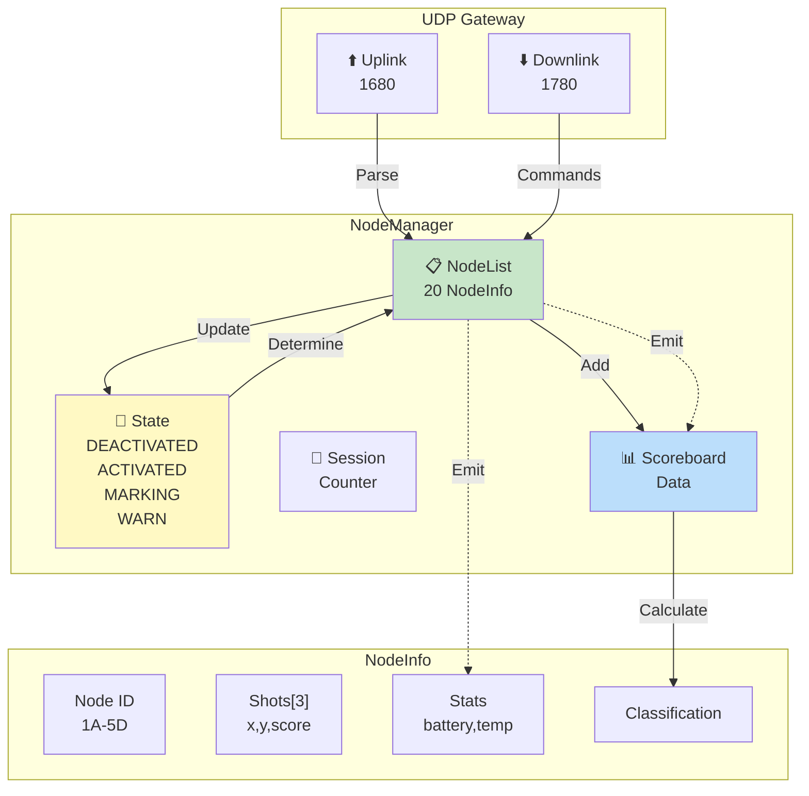

---

## 7. Giao Tiếp SPI/UART STM32 ↔ RPi

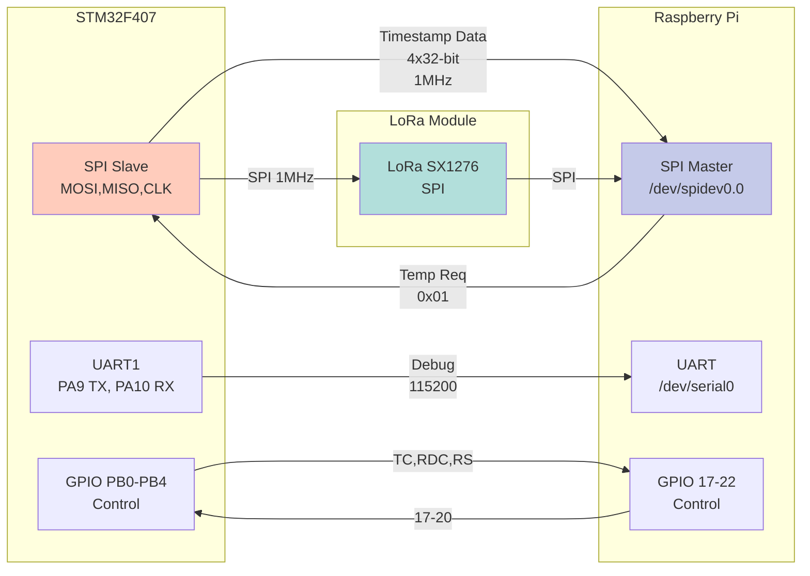

---

## 8. State Machine Node

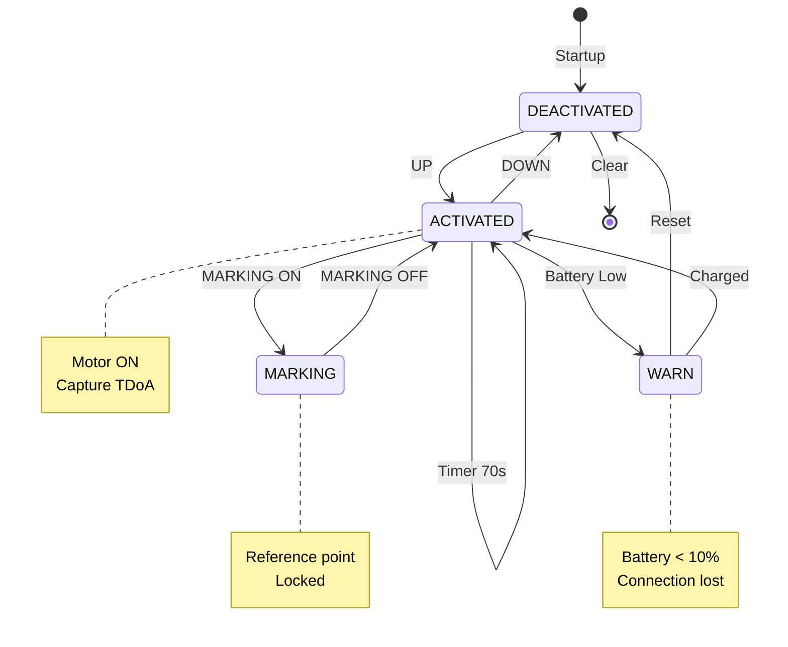

---

## 9. Hardware Connections

```mermaid
graph TB
    subgraph "STM32F407VET6"
        PA0["PA0 ADC0"]
        PA1["PA1 ADC1"]
        PA2["PA2 ADC2"]
        PA3["PA3 ADC3"]
        PA4["PA4 SPI CS"]
        PA5["PA5 SPI CLK"]
        PA6["PA6 SPI MISO"]
        PA7["PA7 SPI MOSI"]
        PA9["PA9 UART TX"]
        PA10["PA10 UART RX"]
        PB0["PB0 GPIO IN DR"]
        PB1["PB1 GPIO OUT RDC"]
        PB2["PB2 GPIO OUT TC"]
        PB4["PB4 GPIO OUT RS"]
        I2C["I2C1 PB6/PB7"]
    end
    
    subgraph "Sensors"
        SA["📡 Sensor A"]
        SB["📡 Sensor B"]
        SC["📡 Sensor C"]
        SD["📡 Sensor D"]
        BME["🌡️ BME280"]
        LORA_M["📶 LoRa"]
    end
    
    subgraph "Raspberry Pi"
        GPIO["GPIO 17-22"]
        SPI["SPI0"]
        UART["UART"]
    end
    
    SA -->|"Analog"| PA0
    SB -->|"Analog"| PA1
    SC -->|"Analog"| PA2
    SD -->|"Analog"| PA3
    
    BME -->|"I2C"| I2C
    
    LORA_M -->|"SPI"| PA5
    LORA_M -->|"SPI"| PA6
    LORA_M -->|"SPI"| PA7
    LORA_M -->|"CS"| PA4
    
    PA9 -->|"TX"| UART
    PA10 -->|"RX"| UART
    
    PB0 -->|"DR"| GPIO
    GPIO -->|"TC/RDC/RS"| PB1
    GPIO -->|"TC/RDC/RS"| PB2
    GPIO -->|"TC/RDC/RS"| PB4
    
    SPI -->|"Master"| LORA_M
```

---

## 10. LoRa Packet Format (Node → Controller)

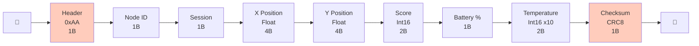

---

## 11. Command Message (Controller → Node)

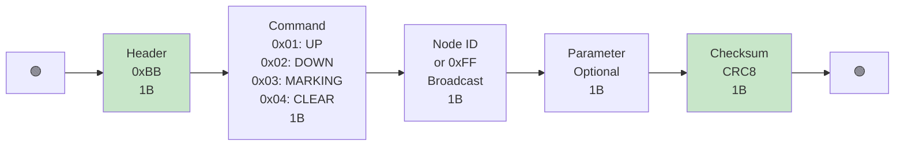

---

## 12. UI Update Flow

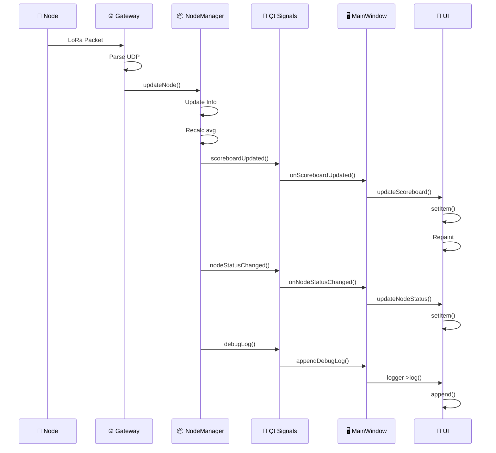

---

## 13. Sơ Đồ Thư Mục Dự Án

```
HTTDTD_v3.1/
├── 📄 README.md
├── 📄 DISCLAIMER.md
├── 📄 SAFETY_WARNING.md
├── 📄 OPERATION_LIMITATIONS.md
├── 📄 CODEMAP.md
├── docs/
│   └── 📄 MERMAID.md ⭐ (File này)
│
├── STM32F407VET6/ (Firmware STM32)
│   ├── Core/
│   │   ├── Inc/ → system.h
│   │   └── Src/ → main.c, tdoa_manager.cpp
│   ├── Drivers/
│   ├── STM32F407VETx_FLASH.ld
│   └── Makefile
│
├── tdoa_node/ (Firmware RPi Node)
│   ├── src/
│   │   ├── main.cpp
│   │   ├── Config.hpp
│   │   ├── TDOASolver.hpp/cpp ⭐
│   │   ├── NodeController.hpp/cpp
│   │   ├── SPIMaster.hpp/cpp
│   │   └── LoRaModule.hpp/cpp
│   ├── Makefile
│   └── CMakeLists.txt
│
└── controller/ (Controller Qt)
    ├── main.cpp ⭐ (SafetyDialog)
    ├── MainWindow.hpp/cpp
    ├── SafetyAcknowledgementDialog.hpp/cpp ⭐
    ├── NodeManager.hpp/cpp
    ├── UdpGateway.hpp/cpp
    ├── ScoreCalculator.hpp/cpp
    ├── Logger.hpp/cpp
    ├── Makefile
    └── resources/
```

---

## 14. Luồng Dữ Liệu Toàn Hệ Thống

```
🎯 Target
    ↓
💥 Impact → Piezo
    ↓
📡 STM32 Capture 4x timestamps @ 168MHz
    ↓
🔢 TDOASolver: Chan + LM
    ├─ TDOA: tB-tA, tC-tA, tD-tA
    ├─ Speed: 331.5 + 0.607*T
    └─ Result: (x, y) cm
    ↓
🌡️ BME280: Read Temperature
    ↓
📶 LoRa: Send Packet
    ↓
📡 Gateway: UDP Receive 1680
    ↓
📦 NodeManager: Parse & Store
    ├─ Update NodeInfo
    ├─ Calc avg (x, y)
    └─ Determine classification
    ↓
📊 Qt Signals: scoreboardUpdated()
    ↓
🖥️ MainWindow: updateScoreboard()
    ↓
🎨 UI: Display Table
    ├─ Node, Score, X, Y, Avg, Classification
    └─ Status: Battery, Temp, Connection
```

---

## 15. Error Handling & Recovery

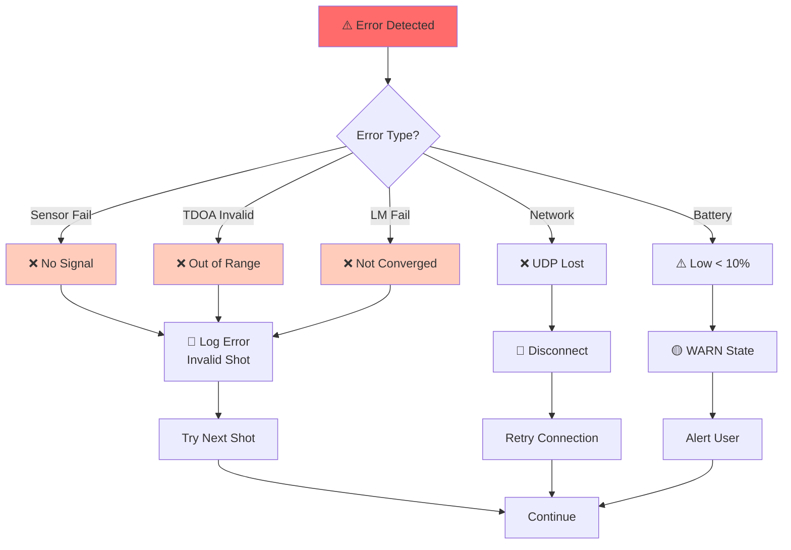

---

## 16. Lifecycle Buổi Tập Luyện

```mermaid
timeline
    title Lifecycle Buổi Tập Luyện
    
    section Startup
        00:00 : 🚀 Start Controller
        00:05 : ⚠️ SafetyDialog Read
        00:35 : ✅ Dialog OK
        01:00 : 🔌 UDP Listen 1680
        02:00 : 📡 20 Nodes Connected
    
    section Preparation
        05:00 : 🔘 Prepare to Fire
        05:30 : UP Node 1A
        05:35 : ACTIVATED
        06:00 : Motor On 70s
        06:30 : Ready
    
    section Firing
        10:00 : 💥 BULLET HIT
        10:00 : Capture 4x TS
        10:10 : TDOASolver Calc
        10:20 : LoRa Send
        10:30 : Update Scoreboard
        10:35 : Display x=25.3 y=15.2 Score=95
    
    section Adjustment
        15:00 : Motor Auto OFF
        15:05 : DEACTIVATED
        15:30 : View Result
        20:00 : MARKING ON
        25:00 : CLEAR for Next Round
    
    section Finish
        60:00 : Session End
        60:30 : Generate Report
        61:00 : Export Data
        61:30 : Close App
```

---

## 📌 Chú Thích Ký Hiệu

| Ký Hiệu | Ý Nghĩa |
|---------|---------|
| 🎯 | Target |
| 💥 | Impact |
| 📡 | Sensor/Module |
| 🖥️ | Computer |
| ⚡ | Processing |
| 📦 | Package/Data |
| 🔢 | Calculation |
| ⚙️ | Algorithm |
| 📊 | Data/Table |
| 🎨 | UI/Interface |
| ⏰ | Timer |
| 🌡️ | Temperature |
| 📶 | LoRa/Wireless |
| 🔌 | Connection/GPIO |
| ✅ | Success |
| ❌ | Error/Failure |
| ⚠️ | Warning |
| 🚀 | Startup |
| 📝 | Log/Output |
| 💾 | Storage |

---

**Cập nhật:** 26 Tháng 5 Năm 2026  
**Phiên bản:** 1.0  
**Tác giả:** Chiêm Dũng (Dunghero1412)
```
```